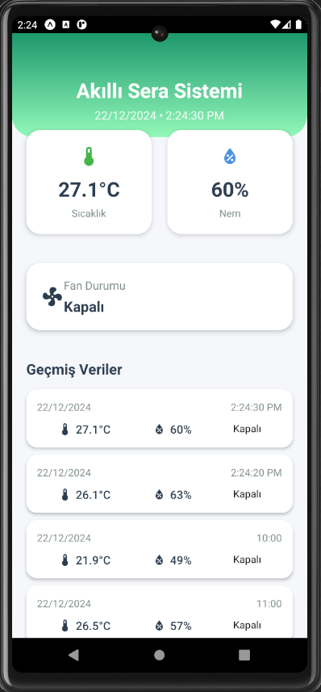

# Fan Destekli Akıllı Sera Sistemi

Bu proje, sıcaklık ve nem koşullarını izlemek ve sıcaklık 30°C'yi aştığında otomatik olarak fanı çalıştıran bir sistem geliştirmeyi amaçlamaktadır. ESP32 mikrodenetleyicisi, DHT11 sıcaklık ve nem sensörü ve bir röle modülü kullanılarak kontrol edilen bir fan sistemi entegre edilmiştir. Veriler Firebase Realtime Database'e kaydedilir ve mobil ve web uygulamaları aracılığıyla görselleştirilir.

## Özellikler

- **Sıcaklık ve Nem Takibi**: Sıcaklık ve nem değerlerini ölçer ve verileri düzenli olarak Firebase Realtime Database'e gönderir.
- **Fan Kontrolü**: Sıcaklık 30°C'yi aştığında fan otomatik olarak çalışır.
- **Mobil ve Web Arayüzü**:
  - Mobil arayüz: Güncel veriler ve geçmiş sıcaklık/nem kayıtlarını gösterir.
  - Web arayüzü: Daha geniş bir ekran düzeniyle aynı bilgileri sağlar.
- **Firebase Desteği**: Veriler gerçek zamanlı olarak bulutta saklanır ve cihazlar arası senkronize edilir.

## Donanım

1. **ESP32**: Mikrodenetleyici.
2. **DHT11 Sensörü**: Sıcaklık ve nem ölçümü için.
3. **Röle Modülü**: Fanın kontrolü için.
4. **Fan**: Sıcaklığı kontrol etmek için kullanılır.

## Yazılım

### Kullanılan Teknolojiler

- **Python**: ESP32 üzerinde çalıştırılan kontrol kodları için.
- **Firebase Realtime Database**: Verilerin bulutta saklanması için.
- **React Native**: Mobil uygulama geliştirmek için.
- **HTML, CSS, JavaScript**: Web arayüzü geliştirmek için.

Nasıl Kullanılır?
- **Donanımı Kurun**: ESP32, DHT11 sensörü ve röle modülünü bağlayın.
- **ESP32 Kodunu Yükleyin**: KOD.py dosyasını ESP32'ye yükleyin.
- **Firebase Yapılandırması**: Firebase Realtime Database ayarlarını yapılandırın.
- **Mobil ve Web Uygulamayı Kurun**: İlgili kaynak kodları mobil cihazınıza veya web sunucunuza dağıtın.
- **Fan Destekli Sera Sisteminizi Kullanıma Alın.**

## Görseller

### Mobil Uygulama Ekranı

### Web Uygulama Arayüzü

### Sera Modeli

### Afiş

### Firebase Veritabanı

